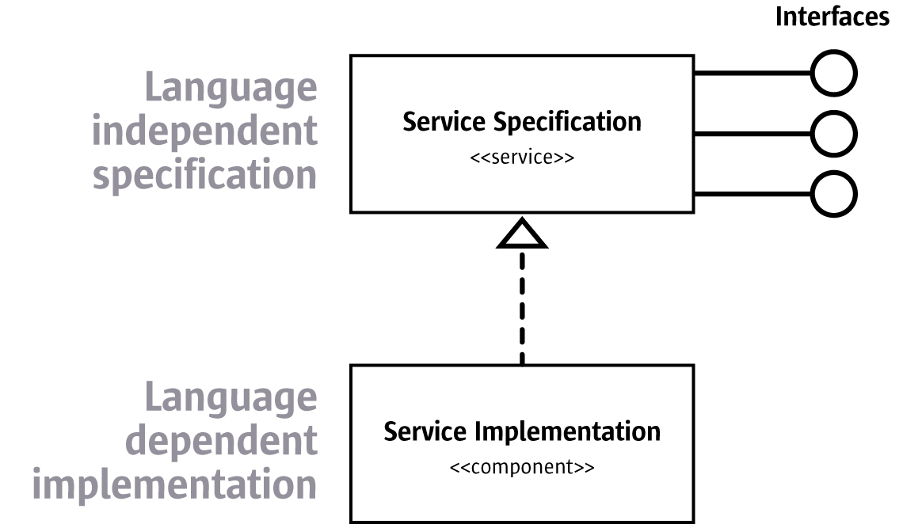

# Universal Network Objects

UNO is a component model that allows LibreOffice to create objects \(components\) that can communicate between processes, and across network boundaries. 

UNO runs in what is known as a UNO Runtime Environment \(URE\). It is similar in many ways to COM+, Corba and Mozilla's XPCOM technologies. Each component that is created is operated on via _interfaces_ from a _service_. An interface describes one aspect of an object, however each object might have a variety of aspects to its functionality. Thus the concept of a service must be introduced - basically it specifies the object's functionality via multiple services. The object then inherits the service, which it must then concretely implemented.

   
**Figure: Services in LibreOffice**  
Source: [OpenOffice](https://wiki.openoffice.org/wiki/File:RelationshipSpecImpl.png), License: ALv2

Sometimes a question is raised as to why LibreOffice uses its own component technology. This was a decision early in the history of StarView and, [as documented on OpenOffice.org](http://www.openoffice.org/udk/common/man/uno_the_idea.html), the chief reasons were that:

* COM/DCOM did not support exception handling
* whilst CORBA does excellent remote communication, it does not handle interprocess communication very well
* Java RMI can only be used in Java based enviroments

With this in mind, StarView were able to create a reasonably fast, full featured remote and local component technology. The UNO implementation that they came up with has the following features:

* a binary specification of the memory layout for types which could be implemented for many different languages
* implements all access to components via a base interface, `XInterface`, which uses the same mechanism as COM to access it \(`queryInterface`\) which allows the interface to be extended
* a UNO IDL compiler is included to compile UNO IDLs, which are similar to CORBA's IDL, but extends it with the `service` keyword
* components exist within different runtime environments depending on the language they are implemented in, and use bridges to communicate with one another
* all calls to a component in a binary environment are sent through a single, dynamic dispatch method, and all calls contain a full description of the method, which means: method name, argument types, return type, exceptions, and additional information. This simplifies bridging environments written in different languages, in different processes or even in situations where the environment is on a different computing environment across a network

## Startup

It is instructive to see how UNO is started in LibreOffice. This is done via the function `cppu::defaultBootstrap_InitialComponentContext()`. This function finds the configuration file for the URE, which stores information about the types and services that are implemented in UNO. 

LibreOffice creates a service manager and a type manager. Before we can understand what a service manager and a type manager are, and how they are constructed, there are a few concepts we must understand first:

* Types
* Services
* Interfaces

## Types

### Basic types

UNO was designed to be language agnostic. Due to this, it has it's own set of types and these must be mapped to the language that the component is being developed in \(we call this the _language binding_\). The following are the basic, fundamental types:

| UNO name | Description | Type library enumeration | C++ type |
| :--- | :--- | :--- | :--- |
| void | empty type | `typelib_TypeClass_VOID` | `void` |
| boolean | Boolean type | `typelib_TypeClass_BOOLEAN` | `sal_Bool` |
| byte | signed 8-bit integer type | `typelib_TypeClass_BYTE` | `sal_Int8` |
| short | signed 16-bit integer type | `typelib_TypeClass_SHORT` | `sal_InT16` |
| unsigned short | unsigned 16-bit integer type | `typelib_TypeClass_BYTE` | `sal_uInt16` |
| long | signed 32-bit integer type | `typelib_TypeClass_LONG` | `sal_uInt32` |
| unsigned long | unsigned 32-bit integer type | `typelib_TypeClass_UNSIGNED_LONG` | `sal_Int32` |
| hyper | signed 64-bit integer type | `typelib_TypeClass_HYPER` | `sal_Int64` |
| unsigned hyper | unsigned 64-bit integer type | `typelib_TypeClass_UNSIGNED_HYPER` | `sal_uInt64` |
| float | IEC 60559 single precision floating point type | `typelib_TypeClass_FLOAT` | `float` |
| double | IEC 60599 double precision floating point type | `typelib_TypeClass_DOUBLE` | `double` |
| char | 16-bit Unicode character type \(UTF-16 code unit\) | `typelib_TypeClass_CHAR` | `sal_Unicode` |

One further simple type is the UNO string type, however this has no corresponding simple C++ type - it actually maps to the `rtl::OUString` class and the enumeration in the type library is `typelib_TypeClass_STRING`.

One further basic type is an Enum type \(an enumeration\). These are the same concept as a C++ enum, but do not map to enums directly. When creating a UNO enum, they are used with the scope operator - so the enum `com.sun.star.table.CellVertJustify` is defined as `com::sun::star::table::CellVertJustify.TOP`.

These basic types are implemented via a C type library. A type is essentially defined by a type description, and these references to these type descriptions are used when creating new instances of the types. The following is an example of how you can create a type reference:

```cpp
typelib_TypeDescriptionReference* pType 
    = *typelib_static_type_getByTypeClass(typelib_TypeClass_FLOAT);
typelib_typedescriptionreference_acquire(pType);

// use the type

typelib_typedescriptionreference_release(pType);
```

### Enums

To create an enum, the typelib requires an array of `rtl_uString`s to the enumerator names, and an array of integers to define the enumerator name indices. The following is a basic unit test that creates and then releases an enumerator:

```cpp
void Test::testNewEnum()
{
    // create an array of strings { "enum1", "enum2" }
    rtl_uString* sEnumName1 = nullptr;
    rtl_uString_newFromAscii(&sEnumName1, "enum1\0");

    rtl_uString* sEnumName2 = nullptr;
    rtl_uString_newFromAscii(&sEnumName2, "enum2\0");

    rtl_uString** pEnumNames;
    pEnumNames = (rtl_uString**)malloc(sizeof(struct _rtl_uString*) * 2);
    pEnumNames[0] = sEnumName1;
    pEnumNames[1] = sEnumName2;

    // create an array of corresponding enum values for each name (this *could* be { 1, 3 })
    sal_Int32 pEnumValues[2] = { 1, 2 };

    // now we create the new enumerator type description called "testenum"
    typelib_TypeDescription* pType = nullptr;
    typelib_typedescription_newEnum(&pType, OUString("testenum").pData, 1, 1, pEnumNames,
                                    pEnumValues);

    // we need to register this new enum type
    typelib_typedescription_register(&pType);

    // now we need to get a reference to the type
    typelib_TypeDescriptionReference* pTypeRef = nullptr;
    typelib_typedescriptionreference_new(&pTypeRef, typelib_TypeClass_ENUM,
                                         OUString("testenum").pData);

    typelib_typedescriptionreference_acquire(pTypeRef);
    CPPUNIT_ASSERT_EQUAL(OUString("testenum"), OUString(pTypeRef->pTypeName));
    typelib_typedescriptionreference_release(pTypeRef);

    rtl_uString_release(sEnumName1);
    rtl_uString_release(sEnumName2);
    free(pEnumNames);
}
```

This is reasonably self explanatory, however note that you must register enum types before they can be accessed.

### Structs

Structs are classsed as a compound type. This means that a struct is composed of one or more UNO types. A basic struct is actually a created via the `typelib_CompoundTypeDescription` struct in the C type library. Whilst the struct is meant to be opaque, it is still interesting to see how it has been implemented by the LibreOffice developers:

```cpp
typedef struct _typelib_CompoundTypeDescription
{
    /** inherits all members of typelib_TypeDescription
    */
    typelib_TypeDescription             aBase;

    /** pointer to base type description, else 0
    */
    struct _typelib_CompoundTypeDescription * pBaseTypeDescription;

    /** number of members
    */
    sal_Int32                           nMembers;
    /** byte offsets of each member including the size the base type
    */
    sal_Int32 *                         pMemberOffsets;
    /** members of the struct or exception
    */
    typelib_TypeDescriptionReference ** ppTypeRefs;
    /** member names of the struct or exception
    */
    rtl_uString **                      ppMemberNames;
} typelib_CompoundTypeDescription;
```

As you can see, the first element in the structure is a `typelib_TypeDescription` called `aBase`., which describes the actual struct type \(which will be the base type other types can inherit from\). UNO structs support single-inheritence, and this points to the parent struct, which is `pBaseTypeDescription`. If this is a nullptr, then it means that the struct is the root class in the heirachy. 

The struct members are defined by an array of member types, `ppTypeRefs`, and names of each member, `ppMemberNames`. To get to each member, you need to know the memory offset of each member so an offset table, `pMemberOffsets`, is used. 

It is interesting to note, however, that there are two types of structs - a plain struct, and a parameterized struct which uses the format struct `ParameterizedStruct<T, B>`.The plain struct is defined by `typelib_CompoundTypeDescription` and parameterized structs are defined by `typelib_StructTypeDescription`.

### Types in C++

The type library is wrapped by the C++ `Type` class, which wraps a `typelib_TypeDescriptionReference` pointer. To construct a new Type, you pass it a `TypeClass` enum \(translates to `typelib_TypeClass`\) and a type description string; alternatively you can pass a `typelib_TypeDescriptionReference` pointer. To create a type, you just call on the `Type` constructor.

```cpp
css::uno::Type aTypeVoid; // css::uno::TypeClass::TypeClass_VOID
css::uno::Type aTypeChar(css::uno::TypeClass_CHAR, "char");
css::uno::Type aTypeBool(css::uno::TypeClass_BOOLEAN, "boolean");
css::uno::Type aTypeByte(css::uno::TypeClass_BYTE, "byte");
css::uno::Type aTypeShort(css::uno::TypeClass_SHORT, "short");
css::uno::Type aTypeUnsignedShort(css::uno::TypeClass_UNSIGNED_SHORT, 
                                  "unsigned short");
css::uno::Type aTypeLong(css::uno::TypeClass_LONG, "long");
css::uno::Type aTypeUnsignedLong(css::uno::TypeClass_UNSIGNED_LONG, 
                                 "unsigned long");
css::uno::Type aTypeHyper(css::uno::TypeClass_HYPER, "hyper");
css::uno::Type aTypeUnsignedHyper(css::uno::TypeClass_UNSIGNED_HYPER, 
                                  "unsigned hyper");
css::uno::Type aTypeFloat(css::uno::TypeClass_FLOAT, "float");
css::uno::Type aTypeDouble(css::uno::TypeClass_DOUBLE, "double");
css::uno::Type aTypeString(css::uno::TypeClass_STRING, "string");
css::uno::Type aType(css::uno::TypeClass_TYPE, "type");
css::uno::Type aTypeAny(css::uno::TypeClass_ANY, "any");
css::uno::Type aTypeInterface(css::uno::TypeClass_INTERFACE, 
                              "com.sun.star.uno.XInterface");
```

## UNO Environments

A UNO environment manages collections of objects of the same _Object Binary Interface_ \(OBI\) and of the same _purpose_. The OBI describes how to invoke the objects methods, how to pass parameters and receive results. The purpose describes an aspect of the environment - for example, an environment may implement the UNO binary interface via C++ in a thread-safe fashion. 

Each environment is described via an environmental descriptor of the format `<OBI>[:purpose]*`. Some examples are:

* `java:unsafe` for a Java based environment that is thread-unsafe
* `uno` for an environment that implements the binary UNO ABI and which is thread-safe
* `gcc3:debug` for an environment that implements the GCC3 C++ OBI and that is thread unsafe

Each component lives in a _UNO runtime environment_ \(URE\), which consists of the implementation language and the current process. This means that one process can implement multiple UREs. UREs can communicate with each other via bridges. UREs that are implemented in the one process communicate via a virtual call, and has no overhead. UREs that are implemented in separate processes communicate via UNO bridges. 


### Mapping UREs

For two environments to call on one another, UNO maps one environment to another. To accomplish this, the CPPU module calls on the `uno_getMapping()` function. The mapping is stored in a structure, which has a pointer to an acquire, release and map function. It works as follows:

```cpp
void SAL_CALL uno_getMapping(uno_Mapping** ppMapping, uno_Environment* pFrom, uno_Environment* pTo,
                             rtl_uString* pAddPurpose) SAL_THROW_EXTERN_C()
{
    assert(ppMapping != nullptr);
    assert(pFrom != nullptr);
    assert(pTo != nullptr);
    if (*ppMapping)
    {
        (*(*ppMapping)->release)(*ppMapping);
        *ppMapping = nullptr;
    }
```

The function takes an output parameter to a `uno_Mapping` pointer, and three input parameters to the environment to map from, the environment to map to and the name of the environment purpose. The first task of the function is to ensure that the mapping is released, and it is then cleared.

```cpp
    Mapping aRet;
    Environment aFrom(pFrom), aTo(pTo);

    OUString aAddPurpose;
    if (pAddPurpose)
        aAddPurpose = pAddPurpose;
        
    MappingsData& rData = getMappingsData();
```

C++ mapping objects are instantiated from the C structs, and the function uses OUString for the environment purpose. 

The CPPU module maintains a Standard Template Library `unordered_map` of mapping names to mapping entries, and an `unordered_map` of `uno_Mappings` to mapping entries. You can also register callbacks to find mappings. There is also a list of external bridging libraries that have already been loaded, kept so that they are not loaded a second time. This is all defined in the structure `MappingsData`, and is lazy loaded via the `getMappingsData()` function.

Each mapping entry defines a numerical identifier, the mapping, a pointer to a function to free the mapping and the mapping name:

```cpp
struct MappingEntry
{
    sal_Int32 nRef;
    uno_Mapping* pMapping;
    uno_freeMappingFunc freeMapping;
    OUString aMappingName;

    MappingEntry(uno_Mapping* pMapping_, uno_freeMappingFunc freeMapping_,
                 const OUString& rMappingName_)
        : nRef(1)
        , pMapping(pMapping_)
        , freeMapping(freeMapping_)
        , aMappingName(rMappingName_)
    {
    }
};
```

The function attempt to find an appropriate mapping, first by looking up an existing registered mapping:

```cpp
    {
        MutexGuard aGuard(rData.aMappingsMutex);
        const t_OUString2Entry::const_iterator iFind(
            rData.aName2Entry.find(getMappingName(aFrom, aTo, aAddPurpose)));
        if (iFind != rData.aName2Entry.end())
            aRet = (*iFind).second->pMapping;
    }
```

If there are no registered mappings, then it tries to find an _identity mapping_:

```cpp
    if (!aRet.is() && pFrom == pTo && aAddPurpose.isEmpty())
        aRet = createIdentityMapping(pFrom);
```

An identity mapping is one where the environment is mapped to itself. It is necessary to reduce confusing and redundant code in generic functions. 

If it is not an identity mapping, then we first try to find a _cascade mapping_ and if this fails, then fallback on the callback chain. If this fails, then try to find a direct mapping, and if this fails then find the mapping via UNO.

```cpp
    if (!aRet.is())
    {
        getCascadeMapping(ppMapping, pFrom, pTo, pAddPurpose);

        if (*ppMapping)
            return;

        // try callback chain
        {
            MutexGuard aGuard(rData.aCallbacksMutex);
            for (const auto& rCallback : rData.aCallbacks)
            {
                (*rCallback)(ppMapping, pFrom, pTo, aAddPurpose.pData);
                if (*ppMapping)
                    return;
            }
        }

        aRet = loadExternalMapping(aFrom, aTo, aAddPurpose); // direct try
        if (!aRet.is())
            aRet = getMediateMapping(aFrom, aTo, aAddPurpose); // try via uno
    }
```

What is a cascade mapping? Simply put, the original purpose environment "cascade" through a series of mappings to get to the desired purpose environment.  

The cascade algorithm works as follows:

* **It is a direct mapping if the purposes are the same**.   An example is where you wish to map the "uno:unsafe" environment to the "gcc:unsafe" environment, you simply apply the gcc3\_uno bridge which does the mapping directly 
* **If the mapping between different purposes, a purpose bridge is used.**   For example, to map from between the "uno:unsafe" purpose environment to the uno environment, the unsafe\_uno\_uno bridge is used. 
* **Mediate via the uno environment if not a direct mapping or has no purpose bridge**.   All environments have bridges back to the UNO environment.   So for example, to map the "uno:unsafe" environment to the "uno:affine" environment, the mechanism would be:  - "uno:unsafe" environment uses the unsafe\_uno\_uno bridge to map to the "uno" environment - "uno" environment then uses the affine\_uno\_uno bridge to map to the "uno:affine" purpose environment 
* **If a multi-purpose environment \(chained purpose\) is specified**   First mediate to a uno environment \(which may require mediating via intermediate purpose bridges\), then mediate via a UNO purpose bridge to the purpose required for the final environment, before finally mediating to the desired environment and purpose.   For example, to map the "gcc3:unsafe:debug" environment to the "gcc3:affine" environment the mechanism would be:  - "gcc3:unsafe:debug" environment uses the gcc3\_uno bridge to mediate to the "uno:unsafe:debug" purpose environment - "uno:unsafe:debug" environment uses the debug\_uno\_uno bridge to mediate to the "uno:unsafe" purpose environment - "uno:unsafe" environment uses the unsafe\_uno\_uno bridge to mediate to the "uno" environment - the "uno" environment then uses the affine\_uno\_uno bridge to mediate to the "uno:affine" purpose environment - "uno:affine" environment then uses the gcc3\_uno bridge to mediate to the "gcc3:affine" purpose environment 
* **Always map to the closest uno purpose environment**  For example, to map the "gcc3:debug:unsafe" environment to the "gcc3:debug:affine" environment, the mechanism is:  - "gcc3:debug:unsafe" enviroment uses the gcc3\_uno bridge to map to the interim environment "uno:debug:unsafe" environment - "uno:debug:unsafe" environment mediates to the "uno:debug" purpose environment - "uno:debug" environment mediates to the "uno:debug:affine" purpose environment via the affine\_uno\_uno bridge - "uno:debug:affine" environment mediates to the "gcc3:debug:affine" environment via the gcc3\_uno bridge

If it is not possible to apply a cascade mapping, then the next step is to try the registered callback chain,  if this does not work then the mapping is determined via an external library. If this does not work then the algorithm falls back to attempt to map the UREs via a default UNO mediation.

The final step is to convert from the C++ `Mapping` instance to a `uno_Mapping` struct:

```cpp
    if (aRet.is())
    {
        (*aRet.get()->acquire)(aRet.get());
        *ppMapping = aRet.get();
    }
```

## Type Manager

The type manager initializes by installing a provider. The provider used is an IDL parser, which parses the UNO Interface Definition Language \(IDL\). Once the provider loads the configuration, the type provider is installed via `installTypeDescriptionManager()`:

```cpp
sal_Bool SAL_CALL installTypeDescriptionManager(
    Reference< container::XHierarchicalNameAccess > const & xTDMgr_c )
{
    uno::Environment curr_env(Environment::getCurrent());
    uno::Environment target_env(CPPU_CURRENT_LANGUAGE_BINDING_NAME);

    uno::Mapping curr2target(curr_env, target_env);
    
    Reference<container::XHierarchicalNameAccess> xTDMgr(
        static_cast<container::XHierarchicalNameAccess*>(
            curr2target.mapInterface(xTDMgr_c.get(), cppu::UnoType<decltype(xTDMgr_c)>::get())),
        SAL_NO_ACQUIRE);
```

The above code maps the interface between environments, the instantiates an `XHeirarchicalNameAccess` object.

```cpp
    Reference<lang::XComponent> xComp(xTDMgr, UNO_QUERY);
    if (xComp.is())
    {
        xComp->addEventListener(new EventListenerImpl(xTDMgr));
        // register c typelib callback
        ::typelib_typedescription_registerCallback(xTDMgr.get(), typelib_callback);
        return true;
    }
    return false;
}
```

The type description manager adds an event listener, which when disposed revokes the callback. This callback creates a type description from a name.

## Services

A service is an object that supports given interfaces. There are two forms of services. The older  style definition of a service \(otherwise called an accumulation-based service\) defines a service like a struct - it is composed of other services, interfaces and properties. The newer, preferred styles of service, is a service that implements a single interface, which can itself be derived from multiple other interfaces. 

## Interfaces

So what is an interface? An interface in LibreOffice is defined as a type and specifies a set of attributes and methods that together define one single aspect of an object. Interfaces can inherit one or more other interfaces. By defining interfaces, you clearly define the purpose of the object and allows programming logic to be based around the interface functionality, rather than the implementation details.

All interfaces derive from XInterface. Important standard interfaces are as follows.

### XInterface

Every interface is ultimately derived from `XInterface`.  It provides lifetime control by reference counting and the possibility of querying for other interfaces of the same logical object. Deriving from XInterface, an object needs to implement the `acquire()` and `release()` functions - for object lifetime - and the `queryInterface()` function.

The most important function is `queryInterface()` - this allows a UNO type to be safely casted, even across process boundaries. To find out if an implementation supports a given interface, it passes `queryInterface()` the Type object it wishes to check. If the implementation supports the interface, then it returns a reference to the interface being queries, otherwise if not then it returns a void type.

I have [written a unit test](https://github.com/chrissherlock/libreoffice-experimental/blob/uno/cppuhelper/qa/interface/test_xinterface.cxx) that shows how XInterface is implemented. The interface name is TestInterface:

```cpp
class TestInterface : public css::uno::XInterface
{
public:
    virtual ~TestInterface() {}
    static css::uno::Type const& static_type(void* = nullptr)
    {
        return cppu::UnoType<TestInterface>::get();
    }

    virtual css::uno::Any queryInterface(css::uno::Type const& rType) override
    {
        return cppu::queryInterface(rType, this);
    }
    
    virtual void acquire() override { osl_atomic_increment(&m_refCount); }
    virtual void release() override { osl_atomic_decrement(&m_refCount); }

    sal_uInt32 getNumber() { return 5; }

private:
    oslInterlockedCount m_refCount;
};
```

Let's look at how this works. Firstly, `static_type` is defined to return the `Type` of the object. This is necessary, because I use the helper `queryInterface()` function in cppuhelper:

```cpp
template<class Interface1>
inline css::uno::Any SAL_CALL queryInterface(
    const css::uno::Type & rType,
    Interface1 * p1)
{
    if (rType == Interface1::static_type())
        return css::uno::Any(&p1, rType);
    else
        return css::uno::Any();
}
```

This function takes the type to be queries, and a pointer to the object to be tested. It is very simple - it calls on the object's `static_type()` function to compare it against the type being tested, and if this matches then it returns the implementation as an `Any` object. If it does not match, then it returns a void `Any` object.

## Service Manager

The Service Manager manages a set of components. Here is how it works:


```cpp
    rtl::Reference smgr(
        new cppuhelper::ServiceManager);
    smgr->init(getBootstrapVariable(bs, "UNO_SERVICES"));
```


The Service Manager is initialized by parsing a config file, which the environment variable UNO\_SERVICES points to on application startup. Whilst there is a legacy config files in a binary format, the preferred format is a well defined XML file. The services configuration file starts something like this:


```cpp
<?xml version="1.0"?>
<components xmlns="http://openoffice.org/2010/uno-components">
  <component loader="com.sun.star.loader.SharedLibrary"
  environment="gcc3" prefix="binaryurp"
  uri="vnd.sun.star.expand:$URE_INTERNAL_LIB_DIR/libbinaryurplo.dylib">
    <implementation name="com.sun.star.comp.bridge.BridgeFactory">
      <service name="com.sun.star.bridge.BridgeFactory" />
    </implementation>
  </component>
  <component loader="com.sun.star.loader.SharedLibrary"
  environment="gcc3" prefix="io"
  uri="vnd.sun.star.expand:$URE_INTERNAL_LIB_DIR/libiolo.dylib">
    <implementation name="com.sun.star.comp.io.Pump">
      <service name="com.sun.star.io.Pump" />
    </implementation>
    <implementation name="com.sun.star.comp.io.stm.DataInputStream">
      <service name="com.sun.star.io.DataInputStream" />
    </implementation>
    <implementation name="com.sun.star.comp.io.stm.DataOutputStream">
      <service name="com.sun.star.io.DataOutputStream" />
    </implementation>
    <implementation name="com.sun.star.comp.io.stm.MarkableInputStream">
      <service name="com.sun.star.io.MarkableInputStream" />
    </implementation>
    <implementation name="com.sun.star.comp.io.stm.MarkableOutputStream">
      <service name="com.sun.star.io.MarkableOutputStream" />
    </implementation>
    <implementation name="com.sun.star.comp.io.stm.ObjectInputStream">
      <service name="com.sun.star.io.ObjectInputStream" />
    </implementation>
    <implementation name="com.sun.star.comp.io.stm.ObjectOutputStream">
      <service name="com.sun.star.io.ObjectOutputStream" />
    </implementation>
    <implementation name="com.sun.star.comp.io.stm.Pipe">
      <service name="com.sun.star.io.Pipe" />
    </implementation>
    <implementation name="com.sun.star.comp.io.Acceptor">
      <service name="com.sun.star.connection.Acceptor" />
    </implementation>
    <implementation name="com.sun.star.comp.io.Connector">
      <service name="com.sun.star.connection.Connector" />
    </implementation>
    <implementation name="com.sun.star.comp.io.TextInputStream">
      <service name="com.sun.star.io.TextInputStream" />
    </implementation>
        <implementation name="com.sun.star.comp.io.TextOutputStream">
      <service name="com.sun.star.io.TextOutputStream" />
    </implementation>
  </component>
```


The Service Manager needs the following to manage each component:

* **Loader**: specifies what loads the component, 
* **Environment**: it is loaded in \(e.g. Java, gcc3, etc.\)
* **Module URI:** what the service is implemented in.
* **Service implementations:** this provides an implementation name, in a namespace, can provide an optional contructor function to initialize the service \(there must, however, be an environment provided in the component\)
  * an implementation can have a **Service**, which is defined by a grouping of interfaces
  * an implementation can further be defined as a **Singleton**, which defines a global name for a UNO object and determines that there can only be one instance of this object that must be reachable under this name 


## Modules used to implement UNO

* **store** - legacy .rdb \(resource database\) format, handled services and types but service definitions are now replaced with XML files, and types replaced with unoidl format
* **registry** - wrapper around store to handle binary type database format, the wrapper manipulates and creates the type registry.
* **stoc** - an old registry, reflection and introspection implementation for UNO.
* **xmlreader** - implements a simple, fast pull parser, currently used by configmgr and stoc's simpleregistry code \(used to register UNO components in services.rdb files\). It supports a subset of XML features, but is fast and small.
* **unoidl** - support for UNOIDL registry formats in a unoidl::Manager and unoidl::Provider implementation; also contains helper tools to covert to UNOIDL format, and a few other functions
* **cppu** - stands for C++ UNO, and contains the definitions and implementations for binary UNO.
* **cppuhelper** - helpers for using cppu in C++, e.g. templates for implementing UNO components, bootstrapping
* **i18nlangtag** - code for language tags, LanguageTag wrapper for [liblangtag](http://tagoh.github.io/liblangtag/index.html) and converter between BCP47 language tags, Locale \(Language, Country, Variant\) and MS-LangIDs.
* **jvmfwk** - Wrappers so you can use all the Java Runtime Environments with their slightly incompatible APIs with more ease

